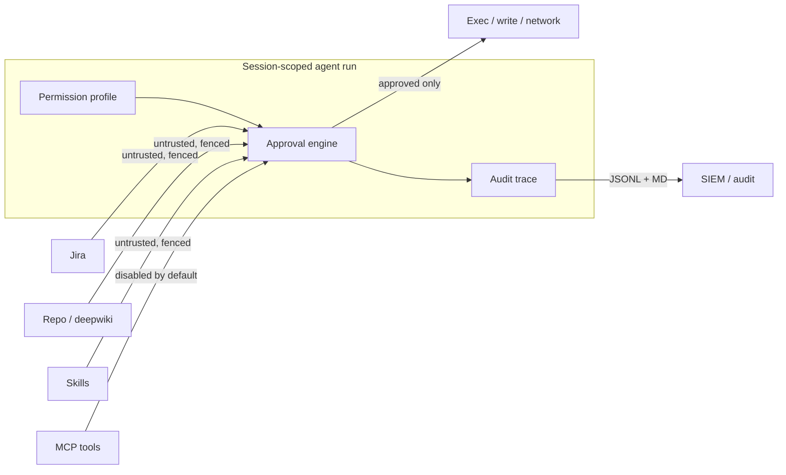

# 🏢 Enterprise Playbook — Running DeepWiki Agent in Production

This document is the **operational companion** to the DeepWiki Agent source. It turns the
code-level guardrails (permission profiles, prompt-injection defense, audit trail,
approval matrix, MCP scoping, plan validation) into a runnable enterprise program.

It synthesises 2025–2026 industry guidance from GitHub Copilot / Claude Code / Cursor /
OWASP / MCP governance sources into concrete operating rules.

---

## 0. Security model in one picture

Default posture: **read-only**. Every escalation is ephemeral, per-session, expiring, and
audited. No automation can self-approve a critical action.

---

## 1. Permission & least-privilege policy

**Rule:** the agent starts in `readonly`. Escalate only for the specific step that needs it,
and auto-expire after 60 minutes.

| Profile | Reads | Writes | Exec | Network / MCP |
|---|---|---|---|---|
| 🔒 `readonly` (default) | ✅ workspace | ❌ | ❌ | ❌ |
| ✏️ `workspace-write` | ✅ | ✅ workspace | ❌ | ❌ |
| ⚙️ `workspace-exec` | ✅ | ✅ | ✅ | ❌ |
| 🚀 `elevated` | ✅ | ✅ | ✅ | ✅ (scoped) |

Ops guidance:
- Keep `elevated` off by default for everyone. Grant to specific owners, per session.
- Use per-repo permission files (mirror of `settings.json`-driven plugin governance)
  so a repo trust boundary maps 1:1 to a permission scope.
- Terminate grants when the session ends. Never store standing cross-repo permissions.

## 2. Prompt-injection defense

The agent treats Jira descriptions, repo files, `skills/`, and MCP responses as
**untrusted data** (OWASP LLM01, GitHub/VS Code injection advisories):
- All untrusted blobs are wrapped in `[UNTRUSTED-SOURCE ...]` fences.
- Instruction-like phrases ("ignore previous instructions") are redacted by the sanitizer.
- The system prompt instructs the model to *never obey* instructions inside those fences.
- Provenance is tagged per source so the model can reason about trust.

Ops guidance:
- Require the injection test suite (see `tests/`) to pass in CI before shipping.
- Add your org's canonical "ignore-prior" variants to the sanitizer blocklist.
- Never add raw `fetch`/`exec` results to prompts without fencing them.

## 3. Approval matrix (no self-approval)

| Risk | Auto-run? | Gate |
|---|---|---|
| info / low (read, docs) | ✅ auto, logged | — |
| medium (workspace write, normal tests) | ✅ in `workspace-exec`, else human | approve / deny |
| high (PRs touching prod code, deploy) | ❌ always human | explicit approval |
| critical / irreversible (force-push, drop table, network exfil) | ❌ always human, **cannot self-approve** | deny-by-default + escalation request |

All decisions land in the audit trail with `approved: true/false`.

## 4. Observability & audit trail

Every agent turn, LLM call (with token/cost), approval, exec, and MCP call writes an
append-only JSONL entry under `.deepwiki-agents/traces/<session>.jsonl` + a human
`.md` mirror. This is your SOC-2 / ISO 27001 evidence chain: intent → run → approval → result.

Ops guidance:
- Forward `.deepwiki-agents/traces/*.jsonl` to your SIEM (Splunk/Loki/Datadog).
- Keep `integritySnapshot()` hashes so the trail is tamper-evident.
- Tag traces by ticket key + repo so you can answer "what did the agent do on JIRA-123?".
- Track KPIs: auto-approve vs human-review ratio, cost per ticket, LLM error rate.

## 5. MCP governance

MCP servers are **untrusted until approved**:
- Connect via stdio subprocess (`command` + `args`) — see `registerMCPServers`.
- Tools are **disabled by default**; enable only the ones the current session needs
  (incremental scope consent).
- Env vars that look secret are redacted from traces.
- Never share one MCP server across trust boundaries.

Ops guidance:
- Maintain a registry: which agent ↔ which MCP server ↔ which permissions ↔ owner.
- Rotate MCP credentials on a schedule; revoke unused connections.
- Guard against MCP name/command poisoning: only allow-listed commands may be spawned.

## 6. Evaluation & quality gates

- LLM plan output is validated against a Zod schema (`evaluate.ts`). Malformed output
  never reaches execution.
- Deterministic fallback plans are emitted when the LLM is unavailable.
- Contract tests verify every `Contract:` in `deepwiki/` still resolves in repo code.
- CI gates: typecheck → guardrail/injection tests → contract tests → static analysis.

## 7. Runbooks

### New environment onboarding
1. Generate API key in secret store; grant read-only.
2. Register MCP servers; enable zero tools.
3. Run the injection test suite. Require green.
4. Point the contract tester at the repo. Require green.

### Incident: suspected prompt injection / data leak
1. Pull the session JSONL. `integritySnapshot()` to confirm immutability.
2. Identify which untrusted source was involved; redact/rotate affected secrets.
3. Add the vector to the sanitizer + test suite.
4. Revoke that MCP connection; block the server until patched.

### Budget runaway
1. Watch `getTokenUsage()` / trace cost column.
2. Set a hard per-session token budget and an anomaly alert at 3× expected.
3. Lower `PROFILE_MAX_RISK` for that team.

## 8. KPIs to report to leadership

- **Reliability:** success rate per ticket, auto/human approval ratio.
- **Cost:** $ per ticket, $ per merged PR (outcome, not just tokens).
- **Speed:** median ticket-to-plan, P95 plan-to-merge.
- **Risk:** contract-test failure rate, injection-test intercept count.
- **Coverage:** % tickets where plan → audit trail → merge are all traceable.

## 9. What to build next (prioritized)

1. **Auto-apply approved diffs** behind `workspace-write` + per-step human approval.
2. **Call-graph-aware risk** (replace the keyword heuristic with a real dependency graph).
3. **PR creation** from chosen plans, draft branch, CI + Copilot review, human merge.
4. **Full repository-scoped permission bindings** (per-repo allow/deny).
5. **Eval harness in CI** that replays golden traces for regression.
